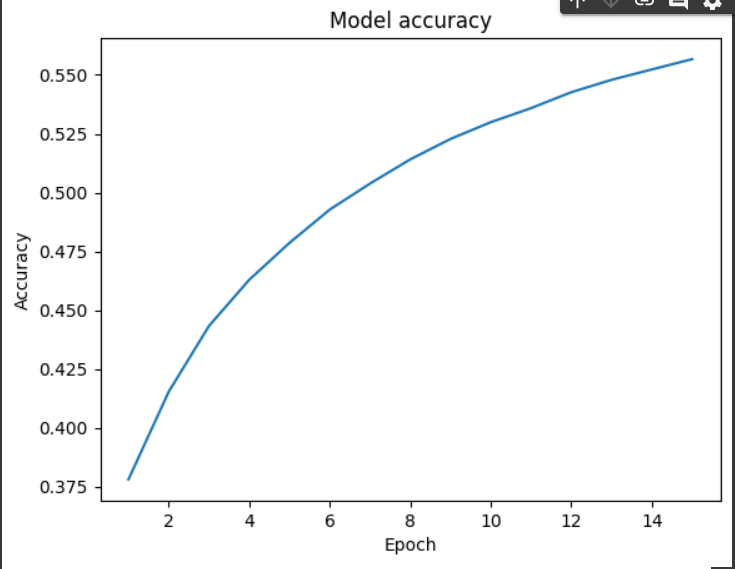
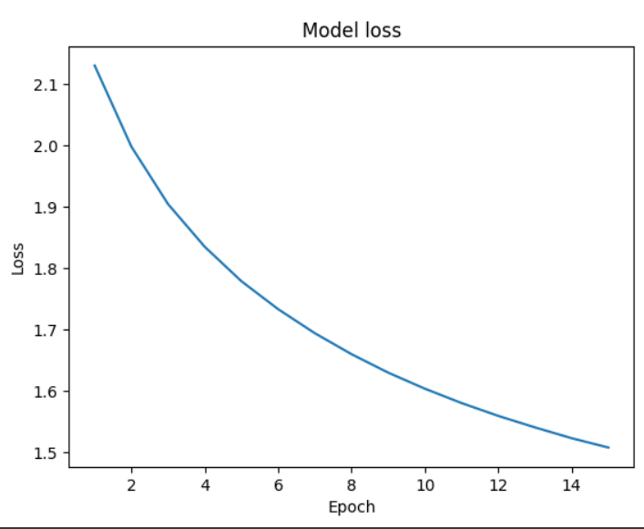

# Text Generation with Project Gutenberg

## Source
My dataset is based on book from Gutenberg library. Link to book: `https://www.gutenberg.org/ebooks/16653`. It book about title "Mythos of Babilonia and Assyria". Dataset created by transform characters array to boolean array. Characters array comes from text. Bolean array is suitable to use with neural network. Data divided by X dataset and Y dataset. X is current character and Y following character.

### Creating dataset
I created a dictionary for characters. Next step was created collection of data by divided all text. 
Fragment code
```
 chars = sorted(list(set(text)))
 char_indices = dict((c, i) for i, c in enumerate(chars))
 indices_char = dict((i, c) for i, c in enumerate(chars))
 maxlen = 40
 step = 3
 sentences = []
 next_chars = []
 for i in range(0, len(text) - maxlen, step):
    sentences.append(text[i: i + maxlen])
    next_chars.append(text[i + maxlen])

 x = np.zeros((len(sentences), maxlen, len(chars)), dtype=bool)
 y = np.zeros((len(sentences), len(chars)), dtype=bool)
 for i, sentence in enumerate(sentences):
    for t, char in enumerate(sentence):
        x[i, t, char_indices[char]] = 1
    y[i, char_indices[next_chars[i]]] = 1
```

## Neural Network
After search process I found out that recurrent neural network is suitable to generate text. Recurrent neural network rely on processing on while data from previous epochs. It is available by ability to store previous inputs data. Neural network consist of layers:
- LSTM layer will be learn and remember previous values.
- Dense output for each character activation function is softmax 

 I used two function from Keras documentation: sample and on_epoch_end. I import also ModelCheckpoint to remember loss decreases from loss. Other callback function reduce learning rate.
 
## Model training
I created model and fitted. Qauntity of epochs equal 5 and batch_size equal 128. Model created train data and print generated text. In solution I use another file to store weight `weights.HDF5`.
```
  model = Sequential()
  model.add(LSTM(128, input_shape=(maxlen, len(chars))))
  model.add(Dense(len(chars), activation='softmax'))

  optimizer = RMSprop(learning_rate=0.01)
  model.compile(loss='categorical_crossentropy', optimizer=optimizer, metrics = ["accuracy"])
```


### Final function
I created final function to text generation.

## Analyze results
Results are showed on plots. 

### Accuracy plots


### Loss plots


Metrics after 13 epoch increase slower and additional epochs will not increase rate in much way. Model achieve not very high accuracy and it is uneffort but rehearsal with additional layers like dropout not helped. As a result generation text can contain mistakes. 
